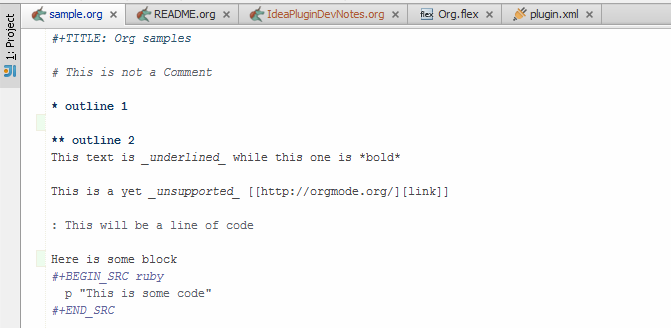

#+TITLE: org4idea: edit org-mode files from IntelliJ

* nauka
:LOGBOOK:
CLOCK: [2024-08-22 Thu 07:29]--[2024-08-22 Thu 07:54] =>  0:25
CLOCK: [2024-08-22 Thu 06:58]--[2024-08-22 Thu 07:23] =>  0:25
:END:
** WWWWW
*** aaa
**** bbb
***** cccc
****** ddddd

[[https://gitter.im/org4idea/Lobby][https://img.shields.io/badge/gitter-org4idea-green.svg]]

* Introduction

This plugin provides basic editing support for [[http://orgmode.org/][org-mode]] files in IntelliJ. At the moment, only  support for syntax highlight of comments and outlines is provided.

_DISCLAIMER_: *org4idea* is still in its /inception / pre-alpha / here-be-dragons phase. Use at your own risk.

* Status and planned features
** Basic Editing
#+BEGIN_SRC scala
  val hello = "Hello";
#+END_SRC

These feature only requires some Intellij customisation of the plugin, and basic lexing rules

  - [X] spellchecking
  - [X] active live template
  - [X] Keywords/blocks highlight
  - [X] Comments
  - [X] bold, slant, code highlight

** Structure aware features
  The following feature will require some working grammar and a parser to be really supported.
  - [X] proper file parsing
  - [X] folding (only for drawers and blocks)
  - [X] folding (for outlines)
  - [X] hotkey to insert new outline (ctrl alt meta enter)
  - [ ] tagging

** Miscellaneous
- [ ] create new org file
- [ ] capture like actions
- [ ] Link support
- [ ] Export and html preview (relying on a background emacs)
- [ ] the one you might [[https://github.com/skuro/org4idea/issues][suggest or implement]]
- [ ] Line marker

* Credits

- Project author :: [[http://skuro.tk][Carlo Sciolla]]
- Contributor :: [[https://github.com/AdrieanKhisbe/org4idea][Adriean Khisbe]]

# §todo: add paragraph about how to contribute?

* License

All files in this repository except OrgMode logos are released under the [[LICENSE.txt][MIT License]].
